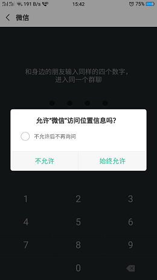

# 问题解答

1. 如何产生一个随机验证码？

 代码实现了我们的要求，能够获取数字和字母的随机四位数，当然数组还可以将字母再补充一下，这里为了省时省力就节省了。 

``` javascript
var arr = '0123456789qwertyuiopasdfghjklzxcvbnm'
function createCode(len) {
    let codeStr = ''
    let length = arr.length
    for(let i = 0; i < len; ++i) {
		codeStr = codeStr + arr[parseInt(Math.random() * length)]
    }
    return codeStr
}
console.log(createCode(4))
```

2. 为什么不同的方式过期时间不同？邮件为什么比短信更长？

3. 微信面对面建群的机制

从微信的访问信息中可以看出，在输入数字的同时会有位置信息的获取。位置信息可以减少同一地区数字相同的可能性。我的实现思路如下：

1. 用户输入四位数字
2. 将四位数字和用户位置发送到服务器
3. 如果该位置所在区域没有这个数字，将用户所在位置和验证码作为相互映射关系，并返回新建群的状态码。
4. 如果验证码在数据库中，并且位于区域附近（大概200m），那么加入该群
5. 如果验证码在数据库中，但是没有在区域中，那么用户所在位置和验证码构成新的映射关系，并返回新建群的状态码


